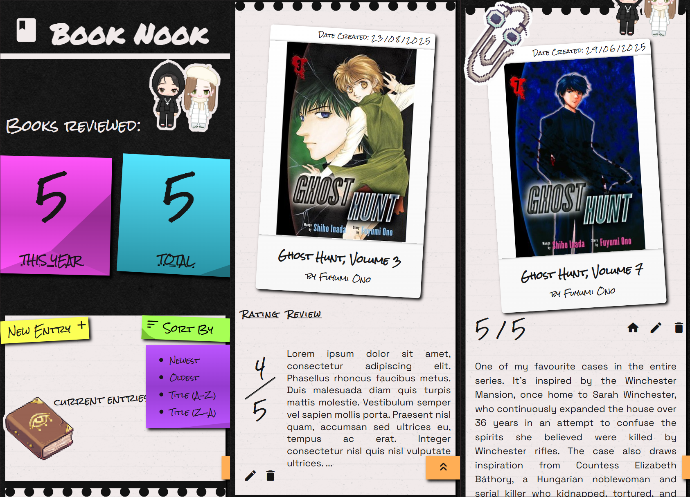

# Book Nook

## Table of contents

- [Overview](#overview)
  - [Screenshot](#screenshot)
  - [Links](#links)
- [Getting started](#getting-started)
- [My process](#my-process)
  - [Built with](#built-with)
  - [What I learned](#what-i-learned)
  - [Continued development](#continued-development)
  - [Useful resources](#useful-resources)
- [Author](#author)
- [Acknowledgments](#acknowledgments)
- [Future Improvements](#future-improvements)

## Overview

### Screenshot



### Links

<!-- TODO: Add link to React version -->

- Same project using a React frontend - [Book Nook (React)](https://www.your-site.com)

## Getting started

To run this project locally:

1. Clone the repository
2. Run `npm install` to install dependencies
3. Run `node index.js`
4. Open `http://localhost:3000` in your browser

## My process

### Built with

- CSS custom properties
  - Flexbox
  - CSS Grid
- Mobile-first workflow
- JavaScript
- Node.js
- Express.js
- PostgreSQL
- NPM: body-parser, axios, dotenv, EJS, pg

### What I learned

**Book Nook** is designed to log books read by the user, while allowing them to review and rate each title. As a capstone project for a full-stack web development course, it was an opportunity to revise Express/Node.js for the server, integrate public APIs, and practice CRUD operations. A key requirement was ensuring data persisted using a PostgreSQL database. Overall, it was quite a learning journey to build everything from scratch again.

I was able to break out of 'tutorial hell' by balancing time between projects and continuing the learning modules. By keeping this workflow, what I learned in the React module became invaluable here - particularly the importance of keeping code DRY. That module emphasized best practices like creating separate files for reusable code snippets. The tricky part was having a partial EJS file render different elements depending on the page — this is where the introduction of conditionals/flags became fundamental to my project.

Below is a snippet of an EJS file showcasing how conditionals are used. This snippet specifically handles the logic for editing a book entry by tailoring what the partial file (_entry.ejs_) should render:

```JS
  <div class="addEdit-entryPage">
      <% if (entryToEdit) { %>
          <%- include("partials/entry.ejs", {
              entryDetails: entryToEdit,
              // Conditionals:
              showLineBreak: false,
              showDatePublished: true,
              showPreview: false,
              showButtons: false,
              showForm: true,
              showEditForm: true,
              showPostForm: false
          }) %>
      <% } %>
  </div>
```

By defining these terms, it ensures that the partial displays only the elements relevent to editing. The snippet below shows which form is rendered, and subsequent route the submission data is sent to on the server side:

```JS
  <% if (showForm) { %>
  <!-- Show either edit or post form, depending on flags -->

    <% if (showEditForm) { %>
      <form action="/edit-entry/<%= entryDetails.review_id %>" method="POST">
        <input type="hidden" name="isbn" value="<%= entryDetails.book_isbn %>" />

        <h2>Update Entry :</h2>
    <% } %>

    <% if (showPostForm) { %>
      <form action="/post-new-entry" method="POST">
      <!-- NOTE: JSON.stringify(book) was not working and resorted to approach below: -->
        <input type="hidden" name="bookTitle" value="<%= entryDetails.title %>" />
        <input type="hidden" name="bookCover" value="<%= entryDetails.book_cover %>" />
        <input type="hidden" name="bookISBN" value="<%= entryDetails.isbn %>" />
        <input type="hidden" name="bookOLlink" value="<%= entryDetails.ol_link %>" />
    <% } %>
    ...
  <% } %>
```

From a UI perspective, creating a collage-themed webpage was fun. I learned that the `white-space` property was useful for translating user-entered line breaks from the form into the individual entry view. I also realized the importance of `box-sizing` for preventing child elements from overflowing their parent containers - this became an issue when certain elements' widths were set to 100%. Another key takeaway was making heavy use of CSS pseudo-elements. They allowed me to add greater depth to the collage theme (like crimps, shadows on post-it notes, stickers, and line breakers) without cluttering the HTML/EJS with purely stylistic elements.

### Continued development

I would like to fork a copy of this project to create a React frontend. This would be a good opportunity to solidify what I learned in the React module and apply it to a completed project. It feels more logical to adapt an existing app rather than building something entirely new, since I can focus solely on React best practices.

### Useful resources

- An article about creating patterns as an attribute of input elements to identify correctly entered submissions from the user:
  https://developer.mozilla.org/en-US/docs/Web/JavaScript/Guide/Regular_expressions
- Helpful for debugging my pattern:
  https://regex101.com/
- Helpful for parsing JSON data:
  https://jsonformatter.org/json-parser
- This article showcased a neat CSS trick to manipulate the border in creating triangles:
  https://css-tricks.com/snippets/css/css-triangle/

## Author

<!-- TODO: -->

- Website - [ShannyxMP](https://www.your-site.com)

## Acknowledgments

- Huge thanks to Dr Angela Yu for providing such a clear and supportive learning experience in Full-stack Web Development.

- [Material Icons](https://marella.github.io/material-icons/) by Google - used under the Apache License 2.0.

- [Transparent Textures](https://www.transparenttextures.com/) for providing textured backgrounds.

## Future Improvements

- [x] Added counters to track total and yearly books reviews
- [x] Create a fixed scroll up button
- [ ] Add authentication feature
- [ ] Have separate 'accounts' for multiple users and subsequently a leaderboard
